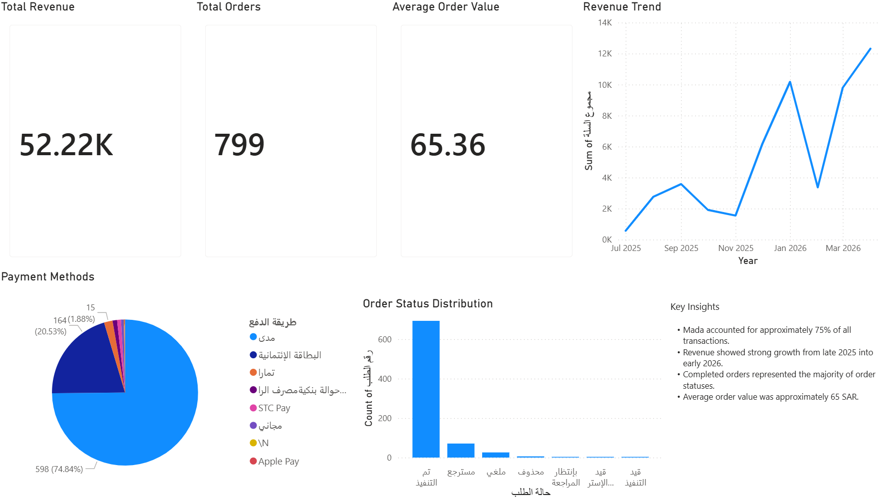

# E-Commerce Sales Dashboard

## Project Overview
This project analyzes e-commerce sales performance using Power BI and Excel.

The dashboard focuses on:
- Revenue trends
- Payment methods
- Order status distribution
- Average order value
- Sales growth analysis

## Tools Used
- Power BI
- Excel
- Data Cleaning
- Business Analytics

## Key Insights
- Mada represented approximately 75% of all transactions.
- Revenue increased significantly from late 2025 into early 2026.
- Completed orders represented the majority of order statuses.
- Average order value was approximately 65 SAR.

## Dashboard Preview

